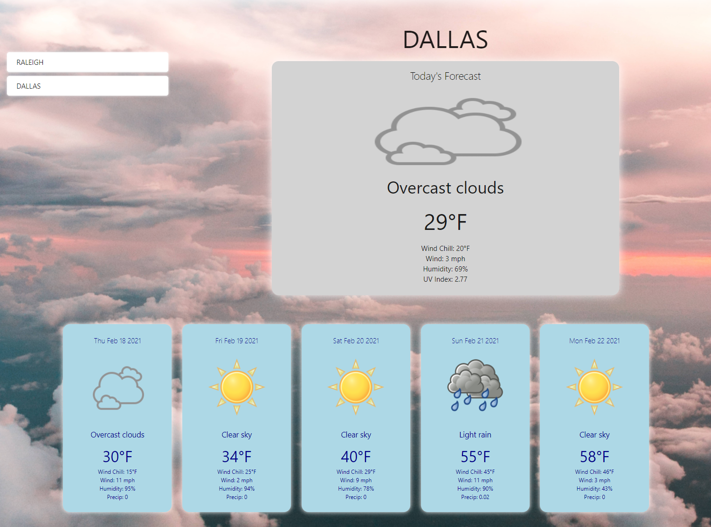

# Forecaster

A simple weather app using the OpenWeather API and HTML, CSS, and JS

## Prerequisites

Browser

## Usage

Enter a city to search for forecast

## Deployment

https://ocskier.github.io/Forecaster/

## Authors

[Jon Jackson](http://github.com/ocskier)

## Contributing
Please make sure to update tests as appropriate.

## License

